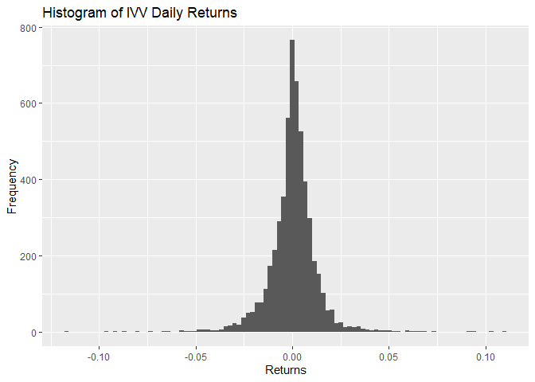
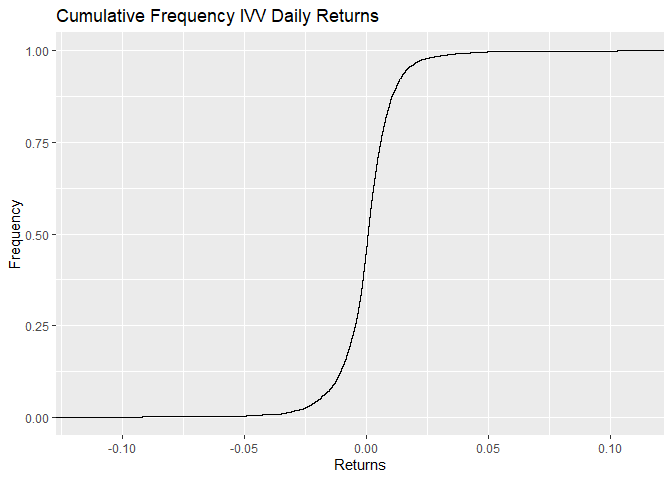

## Objectice

Showing how to use the frequency graphs that we have learned, to plot the daily returns from the IVV etf.


## Loading the libraries and the Data


```r
library(tidyverse)
library(readxl)
library(ggplot2)
library(readxl)

df <- read_excel('IVV.xlsx')
df
```

```
## # A tibble: 5,449 x 2
##    Date                   Close
##    <dttm>                 <dbl>
##  1 2000-05-22 00:00:00 -0.00622
##  2 2000-05-23 00:00:00 -0.0152 
##  3 2000-05-24 00:00:00  0.0150 
##  4 2000-05-25 00:00:00 -0.00917
##  5 2000-05-26 00:00:00 -0.00451
##  6 2000-05-30 00:00:00  0.0329 
##  7 2000-05-31 00:00:00  0.00285
##  8 2000-06-01 00:00:00  0.0160 
##  9 2000-06-02 00:00:00  0.0198 
## 10 2000-06-05 00:00:00 -0.00655
## # ... with 5,439 more rows
```

## Histogram


```r
p <- ggplot(df, aes(Close))

p + geom_histogram(bins = 100,) +
  ggtitle("Histogram of IVV Daily Returns") +
  ylab("Frequency") +
  xlab("Returns")
```

<!-- -->

## Cumulative Plot


```r
ggplot(df, aes(Close)) +
  stat_ecdf(geom = "step") +
  ggtitle("Cumulative Frequency IVV Daily Returns") +
  ylab("Frequency") +
  xlab("Returns")
```

<!-- -->

